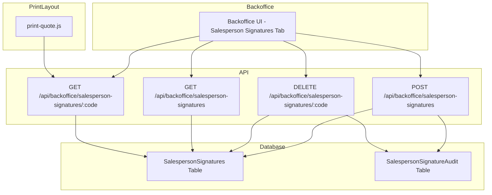

# Salesperson Signature Management System - Design Plan

## Overview
Design a system for admins to upload and manage signatures for each Salesperson. These signatures will appear in the Sales Quote print layout above the "With By" section, matched by `salespersonCode`.

## Requirements Summary
- **File formats**: PNG, JPG only
- **File size limit**: 500KB max
- **Storage**: Database (base64 encoded)
- **Fallback behavior**: Show nothing if no signature uploaded
- **Audit logging**: Include audit trail for uploads/deletions

---

## System Architecture



---

## Database Schema

### SalespersonSignatures Table
Stores signature images linked to SalespersonCode.

| Column | Type | Description |
|---------|------|-------------|
| SalespersonCode | NVARCHAR(50) PK | Salesperson code from Business Central |
| SignatureData | NVARCHAR(MAX) | Base64 encoded signature image |
| FileName | NVARCHAR(255) | Original filename (for audit) |
| ContentType | NVARCHAR(50) | Image MIME type (image/png, image/jpeg) |
| FileSizeBytes | INT | Size in bytes (for validation) |
| UploadedBy | NVARCHAR(255) | Admin email who uploaded |
| UploadedAt | DATETIME2 | UTC timestamp of upload |
| UpdatedBy | NVARCHAR(255) | Admin email who last updated |
| UpdatedAt | DATETIME2 | UTC timestamp of last update |

**Indexes:**
- Primary key on `SalespersonCode`
- Index on `UploadedAt DESC` (for recent uploads)

### SalespersonSignatureAudit Table
Audit trail for signature changes.

| Column | Type | Description |
|---------|------|-------------|
| Id | INT IDENTITY(1,1) PK | Auto-incrementing ID |
| SalespersonCode | NVARCHAR(50) NOT NULL | Salesperson code |
| Action | NVARCHAR(20) NOT NULL | 'UPLOAD' or 'DELETE' |
| OldSignatureData | NVARCHAR(MAX) NULL | Previous signature (before change) |
| NewSignatureData | NVARCHAR(MAX) NULL | New signature (after change) |
| FileName | NVARCHAR(255) | Filename for upload action |
| FileSizeBytes | INT | Size in bytes for upload action |
| ChangedBy | NVARCHAR(255) NOT NULL | Admin email |
| ClientIP | NVARCHAR(50) | IP address of request |
| ChangedAt | DATETIME2 DEFAULT GETUTCDATE() | UTC timestamp |

**Indexes:**
- Index on `SalespersonCode`
- Index on `ChangedAt DESC`

---

## API Endpoints

### 1. GET /api/backoffice/salesperson-signatures
List all signatures with pagination.

**Query Parameters:**
- `page` (default: 1)
- `pageSize` (default: 50)
- `search` (optional): Search by SalespersonCode or SalespersonName

**Response:**
```json
{
  "signatures": [
    {
      "salespersonCode": "SP001",
      "salespersonName": "John Doe",
      "signatureData": "data:image/png;base64,...",
      "fileName": "signature.png",
      "contentType": "image/png",
      "fileSizeBytes": 12345,
      "uploadedBy": "admin@example.com",
      "uploadedAt": "2024-01-15T10:30:00Z"
    }
  ],
  "pagination": {
    "page": 1,
    "pageSize": 50,
    "total": 150,
    "totalPages": 3
  }
}
```

### 2. GET /api/backoffice/salesperson-signatures/:code
Get signature for a specific salesperson.

**Response:**
```json
{
  "salespersonCode": "SP001",
  "signatureData": "data:image/png;base64,...",
  "fileName": "signature.png",
  "contentType": "image/png",
  "fileSizeBytes": 12345,
  "uploadedBy": "admin@example.com",
  "uploadedAt": "2024-01-15T10:30:00Z"
}
```
*Returns 404 if no signature exists.*

### 3. POST /api/backoffice/salesperson-signatures
Upload a new signature.

**Request Body (multipart/form-data):**
- `salespersonCode`: Salesperson code (required)
- `signatureFile`: Image file (required, PNG/JPG, max 500KB)

**Response:**
```json
{
  "message": "Signature uploaded successfully",
  "salespersonCode": "SP001",
  "signatureData": "data:image/png;base64,...",
  "fileName": "signature.png",
  "contentType": "image/png",
  "fileSizeBytes": 12345
}
```

**Validation Errors:**
- 400: Invalid file format (only PNG/JPG allowed)
- 400: File too large (max 500KB)
- 400: SalespersonCode required
- 404: Salesperson not found in BCSalespeople table

### 4. DELETE /api/backoffice/salesperson-signatures/:code
Delete a signature.

**Response:**
```json
{
  "message": "Signature deleted successfully",
  "salespersonCode": "SP001"
}
```

### 5. GET /api/backoffice/salesperson-signatures/audit-log
Get audit log for signature changes.

**Query Parameters:**
- `page` (default: 1)
- `pageSize` (default: 50)
- `salespersonCode` (optional): Filter by specific salesperson

**Response:**
```json
{
  "entries": [
    {
      "id": 1,
      "salespersonCode": "SP001",
      "action": "UPLOAD",
      "fileName": "signature.png",
      "fileSizeBytes": 12345,
      "changedBy": "admin@example.com",
      "clientIP": "192.168.1.1",
      "changedAt": "2024-01-15T10:30:00Z"
    }
  ],
  "pagination": {
    "page": 1,
    "pageSize": 50,
    "total": 100,
    "totalPages": 2
  }
}
```

---

## Backoffice UI Design

### New Tab: "Salesperson Signatures"

Add a new tab button in the backoffice tabs section:

```html
<button onclick="showBackofficeTab('signatures')" id="backofficeTabSignatures" class="px-4 py-2 text-sm font-medium rounded-md transition-colors whitespace-nowrap">
  Signatures <span id="signatureCount" class="ml-1 px-2 py-0.5 text-xs bg-green-200 text-green-700 rounded-full">0</span>
</button>
```

### Tab Content Structure

```html
<div id="backofficeSignaturesTab" class="hidden">
  <!-- Upload Section -->
  <div class="flex flex-col sm:flex-row gap-3 mb-6 p-4 bg-green-50 rounded-lg border border-green-200">
    <div class="flex-1">
      <input id="signatureSalespersonCode" type="text" placeholder="Enter Salesperson Code..."
        class="w-full px-4 py-2 rounded-lg border border-green-300 focus:outline-none focus:ring-2 focus:ring-green-500 focus:border-transparent">
    </div>
    <div class="flex-1">
      <input id="signatureFile" type="file" accept="image/png,image/jpeg"
        class="w-full px-4 py-2 rounded-lg border border-green-300 focus:outline-none focus:ring-2 focus:ring-green-500 focus:border-transparent">
    </div>
    <div class="flex items-center gap-2">
      <span id="signatureValidation" class="text-sm"></span>
      <button id="signatureUploadBtn" class="px-4 py-2 rounded-lg bg-green-600 text-white text-sm hover:bg-green-700 transition-colors">
        Upload
      </button>
    </div>
  </div>

  <!-- Info Banner -->
  <div class="mb-6 p-4 bg-blue-50 rounded-lg border border-blue-200">
    <p class="text-sm text-blue-700">
      <strong>Supported formats:</strong> PNG, JPG | <strong>Max size:</strong> 500KB
    </p>
  </div>

  <!-- Search -->
  <div class="flex flex-col sm:flex-row gap-4 mb-6">
    <div class="flex-1">
      <input id="signatureSearch" type="text" placeholder="Search by Salesperson Code..."
        class="w-full px-4 py-2 rounded-lg border border-slate-300 focus:outline-none focus:ring-2 focus:ring-green-500 focus:border-transparent">
    </div>
    <button id="signatureSearchBtn" class="px-4 py-2 rounded-lg bg-slate-900 text-white text-sm hover:bg-slate-800 transition-colors">
      Search
    </button>
  </div>

  <!-- Signatures Table -->
  <div class="border border-slate-200 rounded-lg overflow-hidden">
    <table class="w-full text-sm">
      <thead class="bg-slate-50 text-slate-600">
        <tr>
          <th class="text-left px-4 py-3 font-medium">Salesperson Code</th>
          <th class="text-left px-4 py-3 font-medium">Salesperson Name</th>
          <th class="text-left px-4 py-3 font-medium">Signature</th>
          <th class="text-left px-4 py-3 font-medium">File Info</th>
          <th class="text-left px-4 py-3 font-medium">Uploaded By</th>
          <th class="text-left px-4 py-3 font-medium">Uploaded At</th>
          <th class="text-left px-4 py-3 font-medium">Actions</th>
        </tr>
      </thead>
      <tbody id="signatureList" class="divide-y divide-slate-100">
        <tr>
          <td colspan="7" class="px-4 py-8 text-center text-slate-500">Loading signatures...</td>
        </tr>
      </tbody>
    </table>
  </div>

  <!-- Pagination -->
  <div id="signaturePagination" class="flex items-center justify-between mt-4">
    <span id="signaturePaginationInfo" class="text-sm text-slate-600"></span>
    <div class="flex items-center gap-2">
      <button id="signaturePrevPage" class="px-3 py-1 rounded border border-slate-200 text-sm hover:bg-slate-50 disabled:opacity-50" disabled>
        Previous
      </button>
      <button id="signatureNextPage" class="px-3 py-1 rounded border border-slate-200 text-sm hover:bg-slate-50 disabled:opacity-50" disabled>
        Next
      </button>
    </div>
  </div>
</div>
```

### Signature Preview in Table

```html
<td class="px-4 py-3">
  
</td>
```

---

## Integration with Print Layout

### Changes to `src/js/salesquotes/print-quote.js`

1. **Add API call to fetch signature:**

```javascript
async function fetchSalespersonSignature(salespersonCode) {
  if (!salespersonCode) return null;

  try {
    const response = await fetch(`/api/backoffice/salesperson-signatures/${encodeURIComponent(salespersonCode)}`);
    if (!response.ok) {
      if (response.status === 404) {
        return null; // No signature uploaded, that's OK
      }
      throw new Error('Failed to fetch salesperson signature');
    }
    const data = await response.json();
    return data.signatureData;
  } catch (error) {
    console.warn('Unable to fetch salesperson signature:', error);
    return null;
  }
}
```

2. **Modify `buildPrintModel` to include signature:**

```javascript
// In buildPrintModel function, after building salesperson object:
const salespersonSignature = await fetchSalespersonSignature(salespersonCode);

return {
  // ... existing fields
  salesperson: {
    name: requestSignature.name || reportContext.salesperson?.name || formData.salespersonName || '',
    phone: formData.salesPhoneNo || requestSignature.phone || reportContext.salesperson?.phone || '',
    email: formData.salesEmail || requestSignature.email || reportContext.salesperson?.email || '',
    signature: salespersonSignature || normalizeDataUri(requestSignature.signature) || normalizeDataUri(reportContext.salesperson?.signature)
  },
  // ... rest of model
};
```

**Priority:** Uploaded signature > BC signature data > No signature

---

## File Structure

### New Files to Create

```
database/migrations/add_salesperson_signatures.sql
api/src/routes/backoffice/signatures.js
```

### Files to Modify

```
src/backoffice.html (add new tab and UI)
api/src/routes/backoffice/index.js (mount signature routes)
src/js/salesquotes/print-quote.js (fetch and display signatures)
```

---

## Database Migration Script

### `database/migrations/add_salesperson_signatures.sql`

```sql
-- Create SalespersonSignatures table
CREATE TABLE SalespersonSignatures (
  SalespersonCode NVARCHAR(50) PRIMARY KEY,
  SignatureData NVARCHAR(MAX) NOT NULL,
  FileName NVARCHAR(255) NOT NULL,
  ContentType NVARCHAR(50) NOT NULL,
  FileSizeBytes INT NOT NULL,
  UploadedBy NVARCHAR(255) NOT NULL,
  UploadedAt DATETIME2 DEFAULT GETUTCDATE(),
  UpdatedBy NVARCHAR(255),
  UpdatedAt DATETIME2
);

-- Create SalespersonSignatureAudit table
CREATE TABLE SalespersonSignatureAudit (
  Id INT IDENTITY(1,1) PRIMARY KEY,
  SalespersonCode NVARCHAR(50) NOT NULL,
  Action NVARCHAR(20) NOT NULL, -- 'UPLOAD' or 'DELETE'
  OldSignatureData NVARCHAR(MAX) NULL,
  NewSignatureData NVARCHAR(MAX) NULL,
  FileName NVARCHAR(255),
  FileSizeBytes INT,
  ChangedBy NVARCHAR(255) NOT NULL,
  ClientIP NVARCHAR(50),
  ChangedAt DATETIME2 DEFAULT GETUTCDATE()
);

-- Create indexes
CREATE INDEX IX_SalespersonSignatures_UploadedAt ON SalespersonSignatures(UploadedAt DESC);
CREATE INDEX IX_SalespersonSignatureAudit_SalespersonCode ON SalespersonSignatureAudit(SalespersonCode);
CREATE INDEX IX_SalespersonSignatureAudit_ChangedAt ON SalespersonSignatureAudit(ChangedAt DESC);
```

---

## Security Considerations

1. **Authentication**: All endpoints require backoffice session (Executive role)
2. **File Validation**:
   - Check MIME type (image/png, image/jpeg)
   - Check file extension
   - Validate file size (max 500KB)
3. **Salesperson Validation**: Verify SalespersonCode exists in BCSalespeople table before upload
4. **Audit Logging**: All changes tracked with admin email and IP address
5. **XSS Prevention**: Base64 data URIs are safe to display in `` tags

---

## Testing Checklist

- [ ] Upload PNG signature successfully
- [ ] Upload JPG signature successfully
- [ ] Reject invalid file format (e.g., PDF)
- [ ] Reject file > 500KB
- [ ] Reject non-existent SalespersonCode
- [ ] Delete signature successfully
- [ ] Audit log records uploads
- [ ] Audit log records deletions
- [ ] Pagination works correctly
- [ ] Search by SalespersonCode works
- [ ] Signature appears in print preview when uploaded
- [ ] No signature shown when none uploaded
- [ ] Fallback to BC signature if uploaded signature deleted
- [ ] Multiple admins can upload signatures
- [ ] Concurrent upload handling (last one wins)
